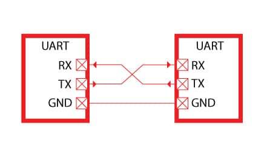

# Brief Introduction of Peripherals and Protocols

Peripherals are external devices that provide input or output signals for the mainboard. Your mouse and screen are one of the examples of peripherals. And that signal requires various protocols to do the communication. For instance, you talk with your friends using Mandarin, English, or Cantonese. Same as hardware, different hardware and application require different protocols.
 
> All the protocols mentioned below are the common setting we use in our development; they can be different.
 

## GPIO

### Defination
General-purpose input/output (GPIO) is a status of input/output (I/O) to, and the name for, an uncommitted digital signal pin on an integrated circuit or electronic circuit board which behavior, including whether it acts as input or output, is controllable by the user at runtime. 

### Push-pull Mode
Push-pull is basically on and off. On the left diagram, if you put 1 in Vin, the Vout will connect to the VDD and give out the signal 1. And if you put 0 in Vin, the Vout will connect to the Ground and give out the signal 0.

### Open-drain Mode
Open-drain is a little different from Push-pull. Normally the Vout will also connect to a VCC with a pull-up resistor. If you put 1 in Vin, it will put Vout in floating(neither connect to VCC nor Ground) and give out the signal 1. And if you put 0 in Vin, Vout will connect to the Ground and give out the signal 0.
  

## PWM

Pulse-width modulation (PWM), is a method of reducing the average power delivered by an electrical signal, by effectively chopping it up into discrete parts. 

PWM can be used in connecting two devices using three wires(Clock, Ground, Data). The Clock line will give out a frequency of pulse when it starts to communicate, and the time between pulses is called the Duty Cycle. For example, the data is from 0-255, if you pull up the data line for about 25% of the Duty Cycle, it sends out integers 64 to the other device. 
> The advantage of using PWM is simple to use, but the disadvantage is unstable; it can be affected by any magnetic field.

## UART

A universal asynchronous receiver-transmitter (UART) is a physical circuit or IC for asynchronous serial communication in which the data format and transmission speeds are configurable.
 

UART can also be used in connecting two devices, and it also uses three-wire, which is Tx, Rx, and Ground. One of the features of UART is that it does not use a clock to a synchronous device. Both devices are configured to be the same frequency before communication.  It can be simplex, half-duplex, or full-duplex.

We can take a look at the frame of UART. It started when the start condition was triggered and followed up by the word data, which usually sends a byte(in binary) at a time, and then it has a parity bit for checking the data integrity and then a stop bit. 

## I2C
The Inter-Integrated Circuit (I2C) Protocol is a protocol intended to allow multiple "slave" digital integrated circuits ("chips") to communicate with one or more "master" chips.
 
PWM and UART can only be used to connect two devices. I2C can be used to connect multiple devices. SCL(Serial Clock) and SDA(Serial Data) both connect to VDD with pull-up resisters.

 
Please take a look at the frame of I2C. It also starts with the start condition, then follows up with 8 bits device address and a bit to indicate write or read(For example, read). And the slave device will send an acknowledge bit. Then it will send an internal register address, and the slave will send the data back.

## CAN
The Controller Area Network (CAN) is a serial communication bus designed for robust and flexible performance in harsh environments, and particularly for industrial and automotive applications.
 
 
CAN, however, does not have a master or slave. All the nodes in can bus are equal, and they all can send or receive messages; it is a multiplex electrical design. Typically the can bus will be connected using two wires, CAN-High and CAN-Low, with two 120-ohm resistors. The CAN-H and CAN-L are both 2.5v in idle state or 0; the CAN-H can pull up to 3.75v, and CAN-L can pull down to 1.25v to create a differential voltage 2.5v, which represent 1. Every node needs a transceiver, which is a transmitter and receiver in one. It converts the data into the electrical signal.

 
This is the frame of a typical CAN-BUS. It also has a start bit and follow-up with a message identifier or ID, then control, which displays the number of data in the data field. Data means the actual data, and the CRC is for checking the data integrity and the acknowledge bit and the end field. 

 
This is the standard procedure of one cycle of the CAN bus.